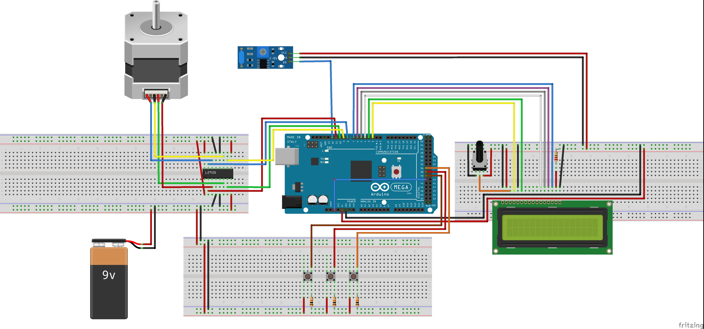

# PSUc: El Juego

## *Español*
---
### Descripción
PSUc es un juego de puntería en el que el usuario intentará pasar todas las estpas del proceso de selección universitario con el fin de llegar a la PUC. 

La dificultad de cada etapa está definida por la distancia en la que se para el blanco y depende de los datos extraídos del proceso de selección real y la categorización es por región, la cual el usuario selecciona al inicio del juego.

### Objetivos
Mostrar de una forma visual la dificultad que tiene cada región para pasar todos los procesos.

Comprara la PSU con un juego en el que si bien se requiere habilidad, el azar y condiciones externas afectan los resultados.

### Componentes
* Arduino Mega 2560
* Puente H L293D
* Pantalla LCD 2x16
* Motor paso a paso Nema 17
* Sensor de vibración SW420
* Potenciómetro
* Resistencias

### Diagrama

### Datos 
Datos obtenidos de los [compendio del DEMRE](http://www.psu.demre.cl/estadisticas/compendios-estadisticos) correspondientes a la PSU del 2016.

---
---
## *English*
---
* Description
* Objectives
* Components
* Diagram
* Data
